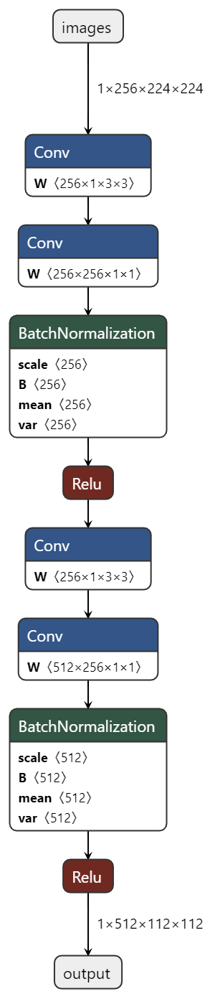

# Requirement

pytorch 1.5

torchvision 0.8.0

# train

```python
python train.py --model=resnet50
```

参数说明：

--model:resnet网络，默认resnet18

--dataset:默认cifar100

--epoch:训练轮数

--loss_coefficient:逻辑蒸馏loss权重系数

--feature_loss_coefficient:特征蒸馏 loss权重系数

--dataset_path:数据集路径

--autoaugment:数据增强

--temperature:温度常数，默认3.0

--batchsize:batch size 默认128

--init_lr:初始学习率，默认0.1

------

# SepConv结构图

<p align="center">
  
</p>

# 理论代码讲解

CSDN：https://blog.csdn.net/z240626191s/article/details/130317998?spm=1001.2014.3001.5501